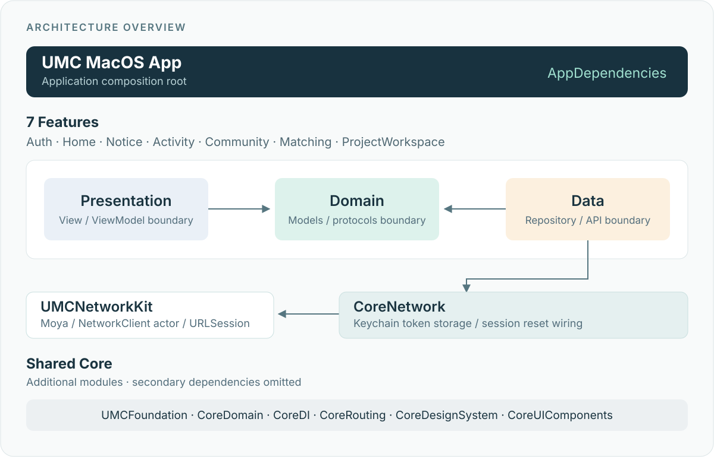

<div align="center">


# UMC Desk

**공지와 대화, 프로젝트 작업을 Mac에서 이어가는 UMC 워크스페이스**


[](https://github.com/UMC-PRODUCT/umc-product-macOS/actions/workflows/tuist-ci.yml)

[프로젝트 위키](https://github.com/UMC-PRODUCT/umc-product-macOS/wiki) · [개발 시작](https://github.com/UMC-PRODUCT/umc-product-macOS/wiki/Development) · [기획·설계](https://github.com/UMC-PRODUCT/umc-product-macOS/wiki/Product-Docs)

</div>

## 프로젝트

UMC Desk는 UMC 구성원이 공지와 대화를 확인하고 프로젝트 자료와 결정사항을 연결해 작업을 이어갈 수 있도록 만드는 macOS 앱입니다.

현재는 Tuist 모듈과 의존성 주입, 네트워크·토큰 처리 기반을 구성한 단계입니다. 앱 진입점은 `EmptyView`이며 화면과 디자인 시스템 구현은 디자인 확정 후 진행합니다.

## 개발 시작

macOS 26 SDK를 포함한 Xcode와 [mise](https://mise.jdx.dev/)가 필요합니다. 아래 명령은 저장소 루트에서 실행합니다.

```sh
make bootstrap   # 고정된 Tuist 버전 설치
make install     # 패키지 의존성 설치
make open        # 프로젝트 생성 후 Xcode 열기
```

매니페스트 편집은 `make edit`, 전체 명령 확인은 `make help`를 사용합니다. 빌드·테스트·환경 설정은 [위키 개발 가이드](https://github.com/UMC-PRODUCT/umc-product-macOS/wiki/Development-Guide)에 정리했습니다.

## 모듈 구조



각 Feature는 **Domain · Data · Presentation**으로 나누고 앱의 `AppDependencies`에서 구현체를 주입합니다. UMC App의 네트워크·토큰 처리 구조는 `UMCNetworkKit`과 `CoreNetwork`에서 이어 사용합니다.

## 문서

| 안내 | 위키 |
|:---|:---|
| 문서 전체 안내 | [위키 홈](https://github.com/UMC-PRODUCT/umc-product-macOS/wiki) |
| 빌드·테스트·환경 설정과 개발 규약 | [개발 가이드](https://github.com/UMC-PRODUCT/umc-product-macOS/wiki/Development-Guide) |
| PRD·앱 설계·구현 계획 | [기획·설계](https://github.com/UMC-PRODUCT/umc-product-macOS/wiki/Product-Docs) |
| 서버 명세 | [서버 문서](https://github.com/UMC-PRODUCT/umc-product-macOS/wiki/Server-Docs) |
| Apple 프레임워크·스킬팩 | [Apple 레퍼런스](https://github.com/UMC-PRODUCT/umc-product-macOS/wiki/Apple-Reference) |

---

<div align="center">

[UMC PRODUCT](https://github.com/UMC-PRODUCT)

</div>
