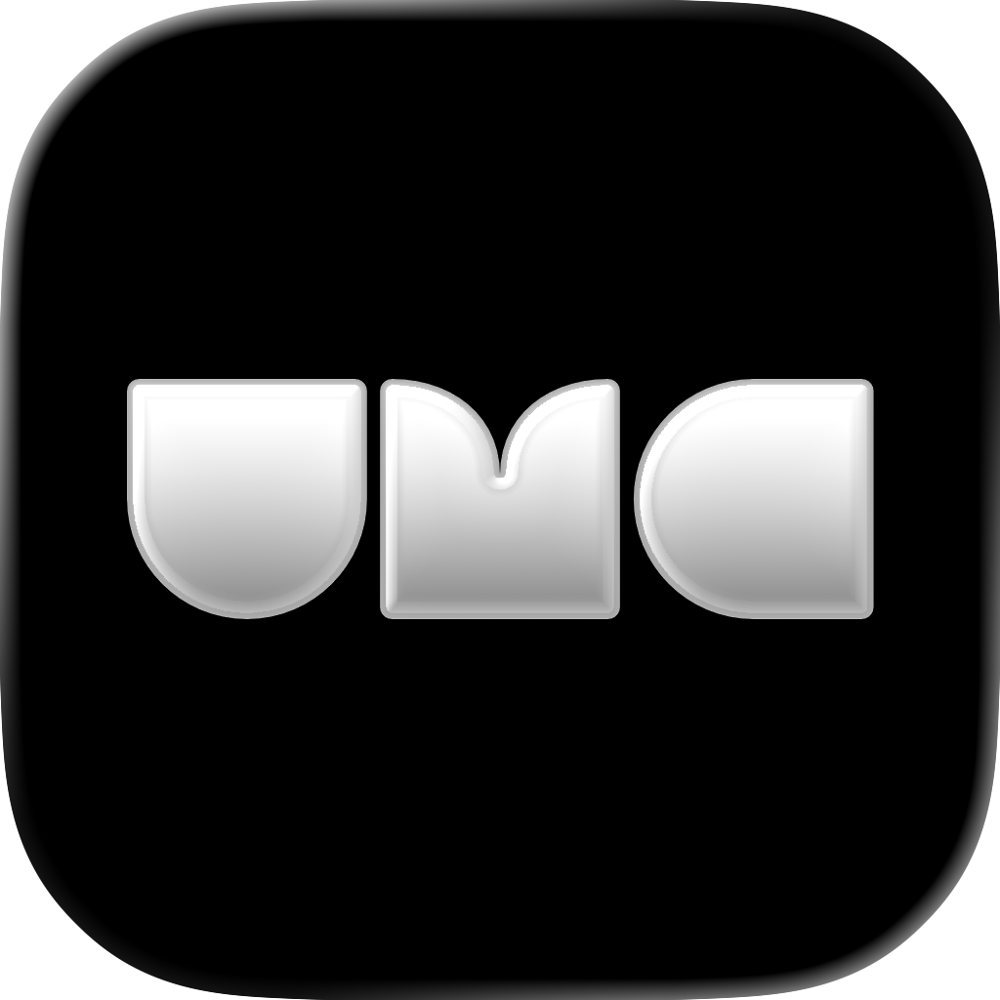
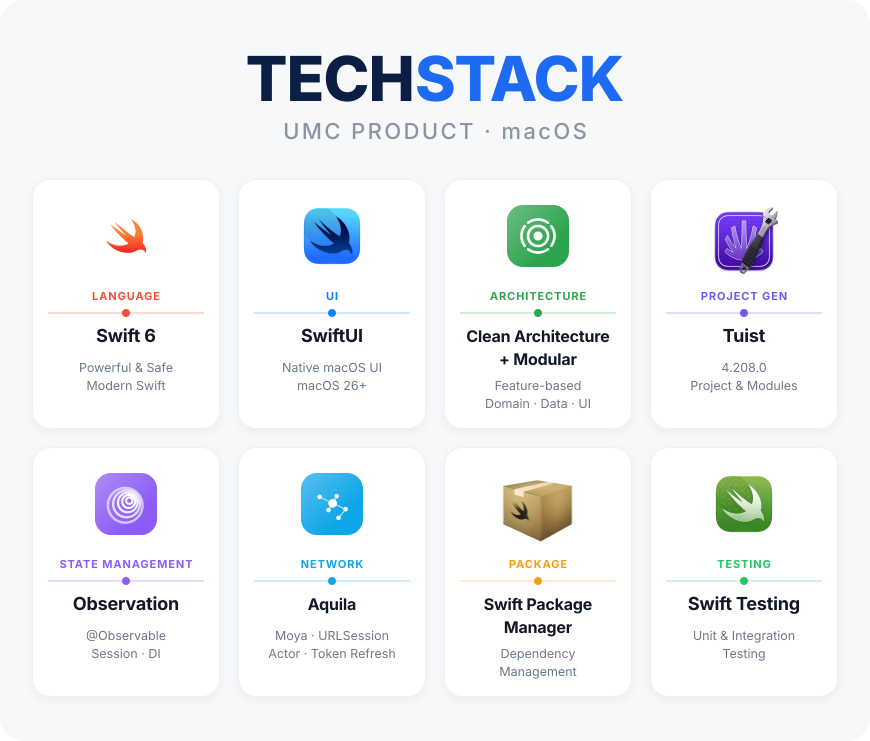

# UMC Desk

**공지와 대화, 프로젝트 작업을 Mac에서 이어가는 UMC 워크스페이스**

[프로젝트 위키](https://github.com/UMC-PRODUCT/umc-product-macOS/wiki) · [개발 시작](https://github.com/UMC-PRODUCT/umc-product-macOS/wiki/Development) · [모듈 구조](https://github.com/UMC-PRODUCT/umc-product-macOS/wiki/Module-Structure)

## 프로젝트

UMC Desk는 UMC 구성원이 공지와 대화를 확인하고 프로젝트 자료와 결정사항을 연결해 작업을 이어갈 수 있도록 만드는 macOS 앱입니다.

현재는 Tuist 모듈과 의존성 주입, 네트워크·토큰 처리 기반을 구성한 단계입니다. 앱 진입점은 `EmptyView`이며 화면과 디자인 시스템 구현은 디자인 확정 후 진행합니다.

## 기술 스택

[Figma 디자인](https://www.figma.com/design/ZOUySD6sh0ToGsgPQTr0Fw/UMC-Mobile-App?node-id=14129-2) · [빌드·테스트 상태](https://github.com/UMC-PRODUCT/umc-product-macOS/actions/workflows/tuist-ci.yml)

## 문서

| 안내 | 위키 |
|:---|:---|
| 문서 전체 안내 | [위키 홈](https://github.com/UMC-PRODUCT/umc-product-macOS/wiki) |
| 개발 환경과 첫 실행 | [개발 시작](https://github.com/UMC-PRODUCT/umc-product-macOS/wiki/Development) |
| Feature·Core 구성과 네트워크·토큰 처리 | [모듈 구조](https://github.com/UMC-PRODUCT/umc-product-macOS/wiki/Module-Structure) |
| 빌드·테스트·환경 설정과 개발 규약 | [개발 가이드](https://github.com/UMC-PRODUCT/umc-product-macOS/wiki/Development-Guide) |
| PRD·앱 설계·구현 계획 | [기획·설계](https://github.com/UMC-PRODUCT/umc-product-macOS/wiki/Product-Docs) |
| 서버 명세 | [서버 문서](https://github.com/UMC-PRODUCT/umc-product-macOS/wiki/Server-Docs) |
| Apple 프레임워크·스킬팩 | [Apple 레퍼런스](https://github.com/UMC-PRODUCT/umc-product-macOS/wiki/Apple-Reference) |

---

[UMC PRODUCT](https://github.com/UMC-PRODUCT)

