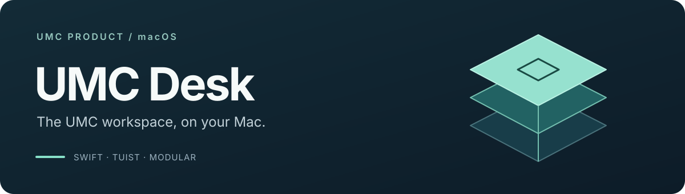

<div align="center">



**공지와 대화, 프로젝트 작업을 Mac에서 이어가는 UMC 워크스페이스**


[](https://github.com/UMC-PRODUCT/umc-product-macOS/actions/workflows/tuist-ci.yml)

</div>

## 프로젝트

UMC Desk는 UMC 구성원이 공지와 대화를 확인하고 프로젝트 자료와 결정사항을 연결해 작업을 이어갈 수 있도록 만드는 macOS 앱입니다.

현재는 Tuist 모듈과 의존성 주입, 네트워크·토큰 처리 기반을 구성한 단계입니다. 앱 진입점은 `EmptyView`이며 화면과 디자인 시스템 구현은 디자인 확정 후 진행합니다.

## 개발 시작

macOS 26 SDK를 포함한 Xcode와 [mise](https://mise.jdx.dev/)가 필요합니다. 아래 명령은 저장소 루트에서 실행합니다.

```sh
make bootstrap   # 고정된 Tuist 버전 설치
make install     # 패키지 의존성 설치
make open        # 프로젝트 생성 후 Xcode 열기
```

| 작업 | 명령 |
|:---|:---|
| Tuist 매니페스트 편집 | `make edit` |
| 앱 빌드 | `make build` |
| 앱·DI 테스트 | `make test` |
| 네트워크·토큰 테스트 | `make test-network` |
| 전체 명령 확인 | `make help` |

빌드는 기본 설정으로 가능합니다. 서버 연결 전 API 주소를 설정하는 방법은 [환경 설정 안내](UMCDesk/Secrets/README.md)를 참고하세요.

## 모듈 구조


각 Feature는 **Domain · Data · Presentation**으로 나누고 앱의 `AppDependencies`에서 구현체를 주입합니다. Core는 공통 기능을 담당합니다. 그림의 화살표는 모듈 의존 방향을 나타냅니다.

UMC App에서 추출한 [UMCNetworkKit](Packages/UMCNetworkKit)은 Moya 타깃을 `NetworkClient` actor와 `URLSession`으로 연결하고 토큰 갱신을 처리합니다. Keychain 저장과 세션 초기화 연결은 `CoreNetwork`가 담당합니다.

## 개발 문서

| 안내 | 문서 |
|:---|:---|
| 제품 방향과 범위 | [PRD](docs/specs/macOS앱_전%20사용자%20데스크톱_PRD.md) · [앱 설계](docs/specs/macOS앱_전%20사용자%20데스크톱_설계.md) |
| 현재 프로젝트 구성 | [Tuist 모듈 구현 계획](docs/plans/macOS_Tuist%20모듈_구현계획.md) |
| 빌드·테스트·모듈 관리 | [Makefile 가이드](UMCDesk/MAKEFILE_GUIDE.md) |
| 코드·협업 규칙 | [코딩 스타일](docs/claude/coding-style.md) · [Git 워크플로우](docs/claude/git-workflow.md) |

---

<div align="center">

[UMC PRODUCT](https://github.com/UMC-PRODUCT)

</div>
