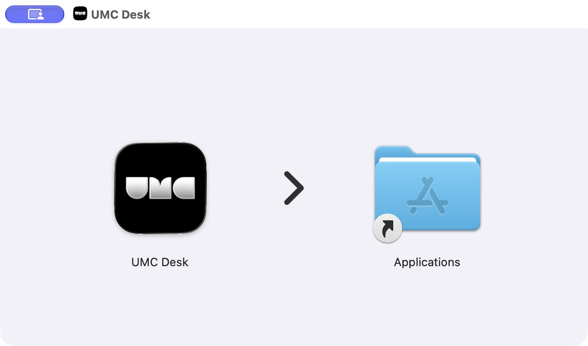

# UMCDesk development

Requirements: Xcode with the macOS 26 SDK or later, Swift 6, and mise.
Test DMG packaging also requires Python 3.10 or later.
Tuist is pinned to 4.208.0, matching UMC App.

Commands work from the repository root or from `UMCDesk/`. The root Makefile delegates to `UMCDesk/Makefile`, preserving variable overrides.

```sh
cd UMCDesk
make bootstrap
make install
make generate
make edit
```

`make edit` opens the Tuist manifest editor for the app, all seven Core projects, all seven Feature projects, and ProjectDescriptionHelpers. Remote SwiftPM dependencies are configured in `Tuist/Package.swift`, which is also included in the generated app workspace. Changes to generated Xcode projects should instead be made in these manifests.

```sh
make help
make doctor
make build
make dmg-test TUIST_BUILD_NUMBER=1
make test-dmg
make pick
make build CONFIGURATION=Release
make test
make test-pick
make test SCHEME=CoreDI
make test-network
make graph
make open
make generate-open
make cache-warm
```

Feature projects create Domain, Data and Presentation static frameworks. Core projects create a single static framework. All destinations are macOS 26. The app owns dependency registration. No navigation or service screens are implemented.

Configure the API environment in `Secrets/Secrets.xcconfig` using the template before connecting to the server. A clean checkout can generate and build with the committed `.invalid` placeholder. The app entry hosts `AuthView`; packaging does not configure a working server connection.

[Aquila](https://github.com/JEONG-J/Aquila) provides HTTP transport, shared token refresh, Moya request mapping and Debug logging. `Tuist/Package.swift` pins the same commit used by UMC App. CoreNetwork retains UMC response decoding, localized error mapping, the macOS Keychain service and app-owned session cleanup. There is no local network package under `Packages/`.

`make edit-project` creates a permanent, non-blocking Tuist edit project for automated inspection. Generated project files and build artifacts are ignored.

Validate changes with package installation, workspace generation, network integration tests, app/DI tests and Debug/Release builds. Use `CODE_SIGNING_ALLOWED=NO` for unsigned local checks. `make test` includes CoreNetwork tests in the app workspace scheme.

The command names and grouped help follow UMC App. `pick` and `test-pick` select a scheme with fzf when installed and numbered input otherwise. Use a scheme with a test target, such as `UMCDesk` or `CoreDI`, for tests. `graph` writes `graph.png` and needs Graphviz (`brew install graphviz`).

Deployment branches such as `release/7` and `testFlight/8` export their trailing number as `TUIST_BUILD_NUMBER`. `CI_BRANCH` supports CI checkouts; an explicit `TUIST_BUILD_NUMBER` overrides automatic parsing. The new macOS app accepts build numbers starting at 1.

## Internal test DMG

Developers run `make dmg-test TUIST_BUILD_NUMBER=1` after the initial setup. It builds
an ad-hoc signed Debug app for Apple Silicon and Intel, then packages `UMC Desk.app`
with the supplied UMC icon. The Finder window shows the app on the left, an arrow in the
middle, and an Applications shortcut on the right. Window metadata is written by
[dmgbuild](https://dmgbuild.readthedocs.io/en/latest/settings.html) without Finder automation.
Pinned packaging tools are installed into `.local-dmg-tools/` on first use; that step needs
network access. Python dependencies and generated files are kept out of Git.



The output is `UMCDesk/dist/UMC-Desk-0.0.1-build1-test.dmg` from the
repository root, or `dist/` when running inside `UMCDesk/`. Share the DMG and the generated
Korean `설치 안내.txt` with teammates. They need macOS 26 or later and do not need Terminal,
Xcode, Python, or mise. Install by dragging UMC Desk onto Applications, then opening it
from Applications. Quit an older test app before replacing it with a new build.

Keep the app version (`MARKETING_VERSION`) at `0.0.1` during internal testing and increase
the build number (`CFBundleVersion`) for each shared build. It does not increase automatically:

```sh
make dmg-test TUIST_BUILD_NUMBER=2  # 0.0.1 (2)
make dmg-test TUIST_BUILD_NUMBER=3  # 0.0.1 (3)
make test-dmg                     # Verify packaging, Finder metadata, and installed signature
```

Test packages are not notarized. If Gatekeeper blocks the first launch, follow
[Apple's Open Anyway instructions](https://support.apple.com/en-us/102445) in
System Settings → Privacy & Security. Ad-hoc signing does not verify the developer's
identity. This command creates local files and does not create Git tags or GitHub Releases.
Check the local `BASE_URL` before sharing builds that need server access.

```sh
make clean      # Remove generated projects and resolved Tuist artifacts
make clean-dd   # Remove local Xcode build data
make reset      # Run both cleanup commands
make install    # Restore dependencies after clean/reset
make generate
```

Cleanup operates inside `UMCDesk/` and preserves module sources and secret configuration. `test-network` runs the CoreNetwork tests against the pinned Aquila dependency.
